# Set up SAP Cloud Connector and establish a Trust to the SAP S/4HANA System

## Introduction

The Cloud Connector is the tool to establish a secure connection between your SAP S/4HANA system and SAP BTP.

This section contains the following steps:  
* Install the Cloud Connector
* Configure certificates for Cloud Connector.
* Set up trust between Cloud Connector and the SAP S/4HANA system
* Configure your SAP S/4HANA system for Principal Propagation.

**Persona:** SAP S/4HANA Administrator

## Step-by-step Setup
### **A: Installation**

For the installation of the SAP Cloud Connector please follow the steps in the SAP Help document - for this mission the Portable Scenario would be sufficient.

[SAP Help: Cloud Connector Installation](https://help.sap.com/viewer/cca91383641e40ffbe03bdc78f00f681/Cloud/en-US/57ae3d62f63440f7952e57bfcef948d3.html)

**Hint:** You can skip the installation of Cloud connector, if you are using a SAP Cloud Appliance Library demo backend system. There is a Cloud Connector pre-installed and ready to be used. Check the **Welcome page** in your CAL system for the links, it usually runs in http://\<IP of your SAP CAL backend\>:8443/.

### **B: Certificate Setup** 
To establish a secure connection between your SAP S/4HANA system and the cloud connector, a trusted relationship must be established. For a SSO communication with principal propagation an intermediate certificate is issued. In this guide, we will use custom certficates for this setup. For a productive usage, it is recommended to use a certificate signed by the trusted certificate authorization of your company.

1. Login to SAP Cloud Connector with the administrator user you have created at the installation.
   
   1.  Click on Configuration in the Menu.
   2.  Click on the **On Premise** tab.
   3.  Click on the the icon **Create and import a self-signed certificate** in the section System Certificate.
   
   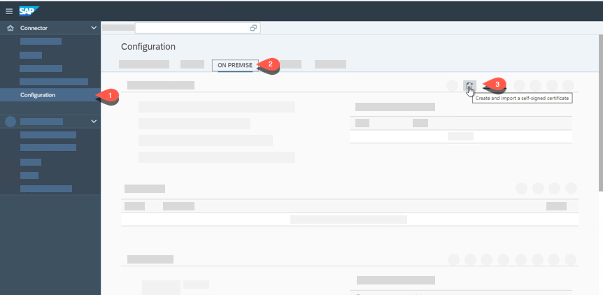

2. In the **Create Self-signed Certificate** window enter the following:
   1. Common Name(CN) eg.: **REFAPPS**
   2. Enter Locality(L) eg.: **Your City**
   3. Organization(o) eg.: **Your Company**
   4. Country(c) eg.: **DE** 
   5. Click on Create
   
   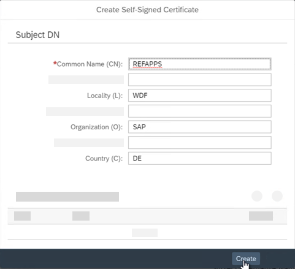

3. Once the self-signed certificate is created, look in the **Configuration** screen and click on **Download certificate in DER format** icon in **System Certificate** section. We will use this certificate in a later step to establish the trust between the SAP Cloud Connector and the SAP S/4HANA system.
   
   
 
4. Create a CA Certificate
   1. Scroll-down to the CA Certificate section and click on **Create and import a self-signed certificate**
  
   Enter the following values:

   2. Common Name(CN) eg.: **REFAPPS**
   3. Enter Locality(L) eg.: **Your City**
   4. Organization(o) eg.: **Your Company**
   5. Country(c) eg.: **DE** 
   6. Click on Create
   
   

5. Setup Principal Propagation
   1. Scroll down to the Principal Propagation section and click on the Edit icon
   2. In the Common Name (CN) field set ${email} as value. 
   
   ***Hint:** the field entry must be ${email} don't use the ${mail} entry from the dropdown box* 
   3. For the other fields keep the default values - press Save
   
   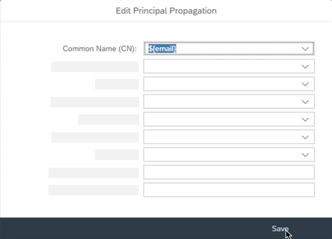

6. Create sample certificate
   1. Click on the **Create a sample certificate** icon
   2. Enter the email address from the user we have created in the **Setup of SAP S/4HANA on-premise system** section.
   3. Click on 'Generate' - This certificate will be used in a later step.
   
   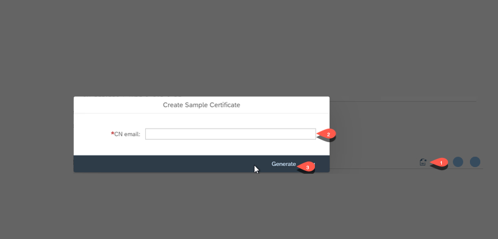

7. Setup User Interface
   1. Click on **User Interface** tab
   2. In the UI certificate, click on **Copy System certificate and re-use as UI certificate** icon. In the popup press OK to overwrite the current UI Certificate.
   3. Click on **Restart** icon in the header and restart the SAP Cloud Connector (wait for restart)
   
     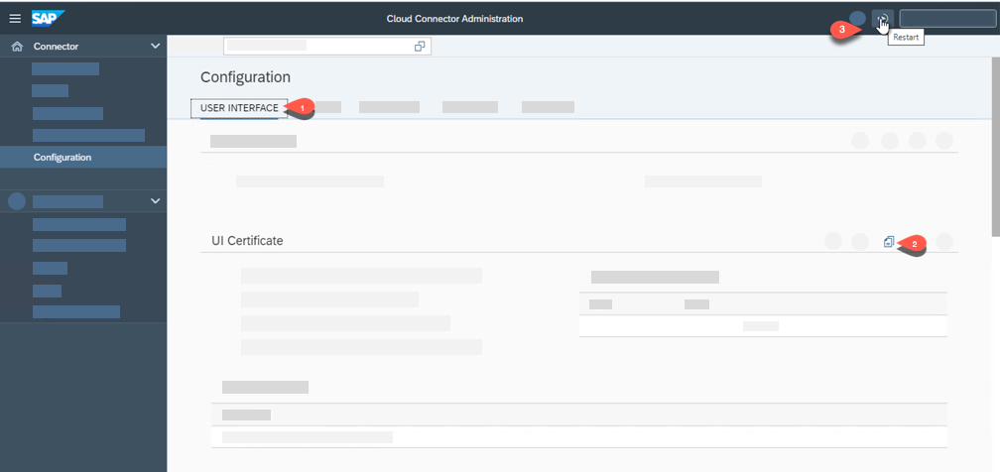

[For more details see SAP Help: Setup Trust](https://help.sap.com/viewer/cca91383641e40ffbe03bdc78f00f681/Cloud/en-US/c84d4d0b12d34890b334998185f49e88.html)

### **C: Create Trust to SAP Cloud Connector and configure Principal Propagation in the SAP S/4HANA System**

***Hint:** The following screenshots are done with SAP GUI 7.50 - by using SAP GUI 7.60 the usage could differ e.g tick button instead of a continue button etc.*

1. Logon to your SAP S/4HANA with SAP GUI
2. Call Transaction STRUST
   1. Click on **Display/Change** icon to Edit mode
   2. Click on **SSL Server standard**
   3. If no sub-folders are present, right click and Create
   4. Scroll down to certificate and click on **Import certificate** icon
   
   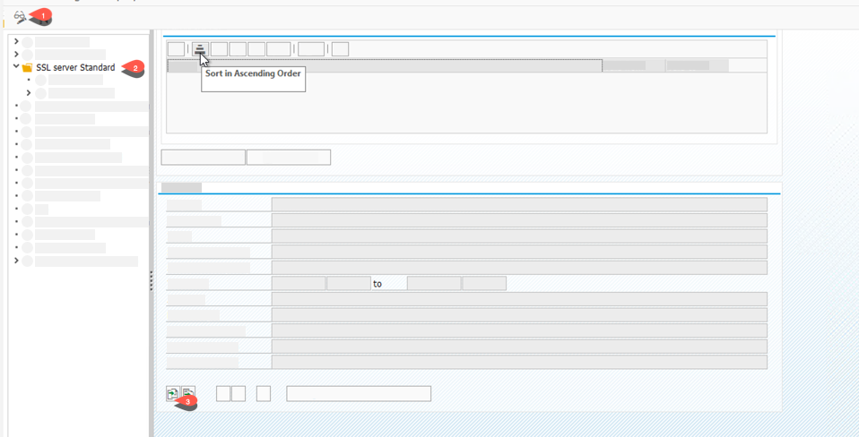

3. Upload Certificate
   1. Under the tab 'File', choose the file path of **sys\_Cert.DER** file which you have download from the SAP Cloud Connector System certificate step 3.
   2. Click **Ok** and confirm
   3. Click on **Add to Certificate List** button
   4. Click on **Save** button

   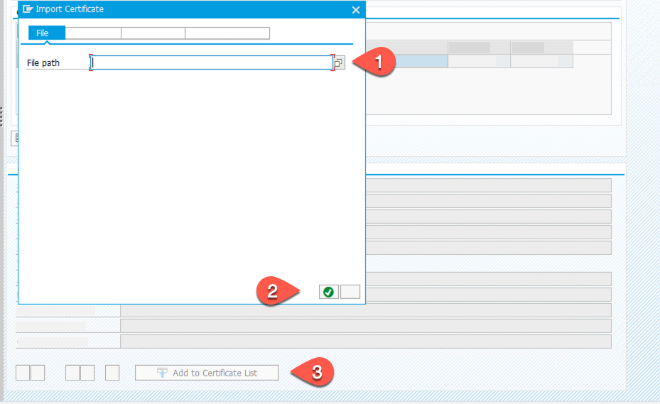
4. Create Certification Rule - call transaction /nCERTRULE
   1. Click on **Display/Change** icon to Edit mode.
   2. Click on **Import certificate** icon next to Subject textbox. Choose the **scc\_sample\_cert.DER** file which you have downloaded from SAP Cloud Connector Principal propagation tab in step 5. 
   3. Click on **Rule** button and confirm.   
   
   

5. Define Rule
   1. In the Certificate Attr. Dropdown choose **CN=<email id of user created>
   2. Choose Login as Email
   3. Click **Ok**
   4. Click on **Save** icon
    
      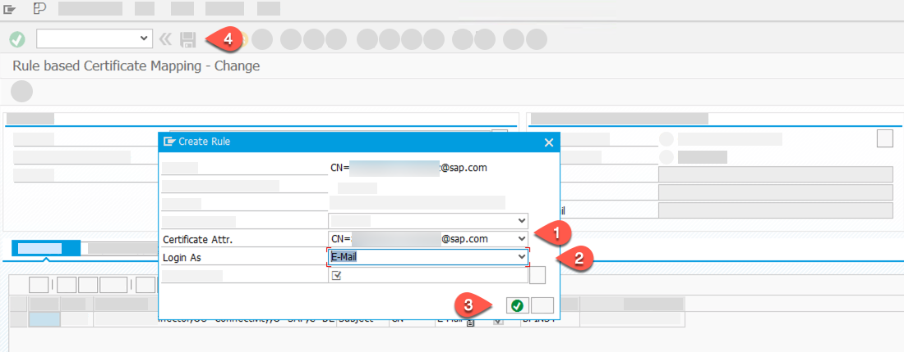

6. Change System Parameter - call transaction /nRZ10
   1. Choose Profile **DEFAULT**
   2. Choose **Extended maintenance** under edit profile
   3. Click on **Change** button and press Save in the popup.
      
   

7. Add a new Parameter in Profile 'DEFAULT' 
   1. Select the **Create Parameter** icon
    
   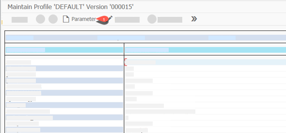

8. Add icm/trusted\_reverse\_proxy\_0 parameter
   1. Enter parameter name as **icm/trusted\_reverse\_proxy\_0**
   2. Enter parameter value as **SUBJECT="CN=\<your CN\>, L=\<your city\>, O=\<your company\>, C=\<your country\>", ISSUER="CN=REFAPPS, L=\<your city\>, O=\<your company\>, C=\<your country\>"**. The values must be the same as from the certificate we have created in SAP Cloud Connector on step 3. Make sure that there is a blankspace between Subject and Issuer as in screenshot below.
   3. Click on **Copy** and then **Back**

   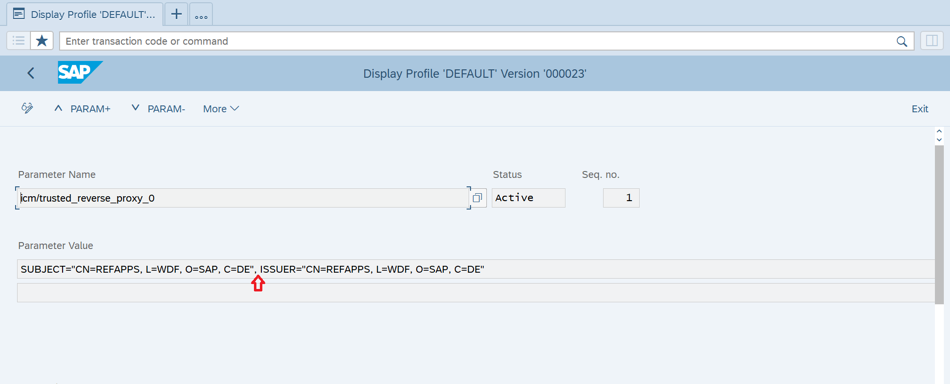
   
   
9. Save the Profile
    1. In the next screen too, click on **Copy** and then **Back**. Click on **Save** button    
    2. Click on **No** (if asked for error check)
    3. Click on **Yes** for activate profile
    
   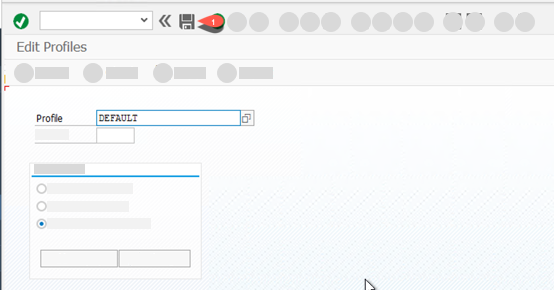
   

10.  Restart ICM 

     For taking the certificate and profile change effect you have to restart the ICM system. - Call transaction **/nSMICM**    
    
     1. In the menu go to **Administration**
     2. For SAP S/4HANA 1909 and before choose **ICM > Hard Shut down > Global**. For SAP S/4HANA 2020 choose **ICM >Exit Soft > Global** 

     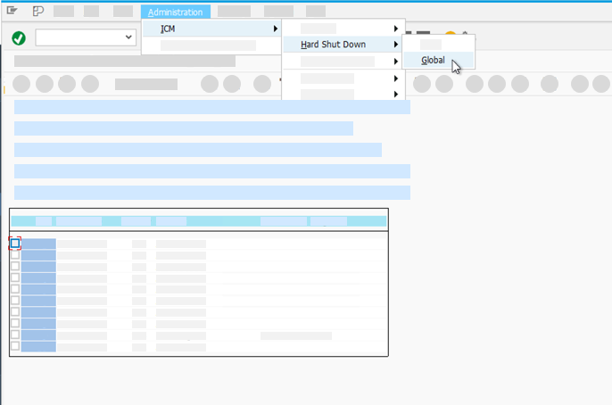 

      
     

     After the restart, your system is ready for Principal Propagation with the SAP Cloud Connector.

## Summary
We have installed the SAP Cloud Connector, established a trust between SAP cloud connector and the SAP S/4HANA system and created a certification rule for handling principal propagation. 

* [See also SAP Note 2610956 for more details](https://launchpad.support.sap.com/#/notes/2610956)
* [SAP Help: Configuring Principal Propagation to an ABAP system](https://help.sap.com/viewer/cca91383641e40ffbe03bdc78f00f681/Cloud/en-US/6705cc350ef44628a42473b3eb72efd8.html)
