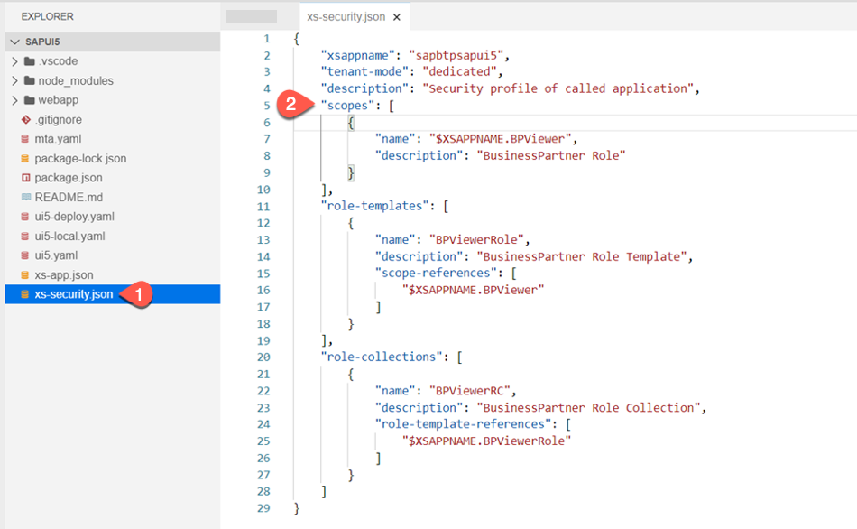
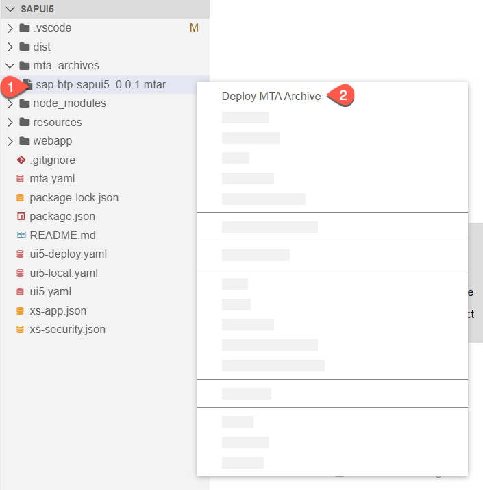
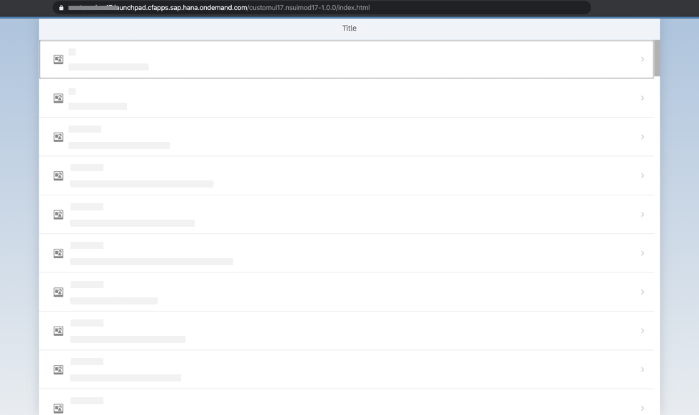

# Building and Deploying a Cloud Application

## Introduction

In this section, we would describe steps to build and deploy your cloud application which was already created using SAP Business Application Studio.

**Persona:** UX Developer

**Abbreviation:** SAP Business Technology Platform = SAP BTP


## Step-by-Step

### Open Business Application Studio and login to your SAP BTP Cloud Foundry subaccount

1. Let us open the service **Business Application Studio** by following the steps described in [Open SAP Business Application Studio](../develop/README.md#open-sap-business-application-studio).
2. If your workspace is stopped, click **Start** to start your dev space and click the name of your dev space to open your workspace.

   

3. Login to Cloud Foundry following the steps described in [Login to CF](../develop/README.md#login-to-cloud-foundry-in-sap-business-application-studio).


### Add scopes and role templates to your HTML5 application
 
1. Click on **Explorer** and open the xs-app.json file.

   
   
2. Add the scope in the xs-app.json file. Go to the xs-app.json add the line in the **routes** section as shown below: **scope**: **$XSAPPNAME.BPViewer**. Add a **,** to the previous line. The block looks like below after adding the line.

   ```
   {
     "source": "^(.*)$",
     "target": "$1",
     "service": "html5-apps-repo-rt",
     "authenticationType": "xsuaa",
     "scope": "$XSAPPNAME.BPViewer"
    }
    ```
 
3. Open xs-security.json and replace the code as shown below inside scope, role templates and role collections.

    ```
    "scopes": [
     {
     "name": "$XSAPPNAME.BPViewer",
     "description": "BusinessPartner Role"
     }
    ],
    "role-templates": [
     {
     "name": "BPViewerRole",
     "description": "BusinessPartner Role Template",
     "scope-references": [
         "$XSAPPNAME.BPViewer"
     ]
     }
    ],
    "role-collections": [
         {
         "name": "BPViewerRC",
         "description": "BusinessPartner Role Collection",
         "role-template-references": [
         "$XSAPPNAME.BPViewerRole"
             ]
         }
     ]
    
    ```
 
4. After replacing, the xs-security.json file looks like below:

    
    
### Building your HTML5 application
   
1. To build our application, there are many ways to do it. Either right-click on the mta.yaml file and choose "Build MTA" or build via commandline. We show you one of the options here. For details, check the official [help page for Building and Deploying Multitarget Applications](https://help.sap.com/viewer/9d1db9835307451daa8c930fbd9ab264/Cloud/en-US/97ef204c568c4496917139cee61224a6.html). 
2. Click on Terminal-> New Terminal and navigate to the project root folder, e.g : cd s4-extendui/
3. Run command 'mbt build'.

    
    
    
### Deploy the HTML5 Application to your SAP BTP space

1. If you want to deploy to a SAP BTP space, make sure you are logged in to your SAP BTP subaccount like shown in step above. 
2. Now let us deploy the built archive. Expand the folder **mta_archives** and right-click on the built file **extend-ui-1.0.0.mtar** and select **Deploy MTA Archive**.

    
    
3. You can see the progress of the deployment in a progress task window **Task: Deploy MTA Archive**.
   
   


### Assigning role collection to the user

In the previous step, we have added a Role Collection **BPViewerRC** in **xs-security.json** file. So only users who are assigned to this role can view the application. 


1. In the SAP BTP subaccount Overview page, click on Security> Trust Configuration.
2. Click on your company Identity Provider which has the users who will login to the application. 
3. Click on **Role Collection Assignment** and Enter your email id and click on **Show Assignments**. This User/Email has to be already configured to your identity provider.

   
   
4. Click on **Assign Role Collection**.
5. Select **BPViewerRC** and click on **Assign Role Collection**. (Same as in previous step).

   
   
### Accessing the deployed application

   
1. To open your deployed HTML5 application, switch to the SAP BTP subaccount page and choose **HTML5 Applications**. Click on the application link to open the application. 
  
   
     
2. Once you open the app in a new browser window, login to the application using your company Identity Provider.
3. Now your HTML5 application fetches the data from the configured backend system.

   

### Result
You have successfully now built and deployed your HTML5 application to SAP BTP which fetches you business partner data from the configured backend system. 

### Related Links

Check the [Cloud Foundry HTML5 Apps Client Help](https://github.com/SAP/cf-html5-apps-repo-cli-plugin) for command line access to APIs exposed by the HTML5 Application Repository service. You can use these commands in SAP Business Application Studio in a Terminal. 
