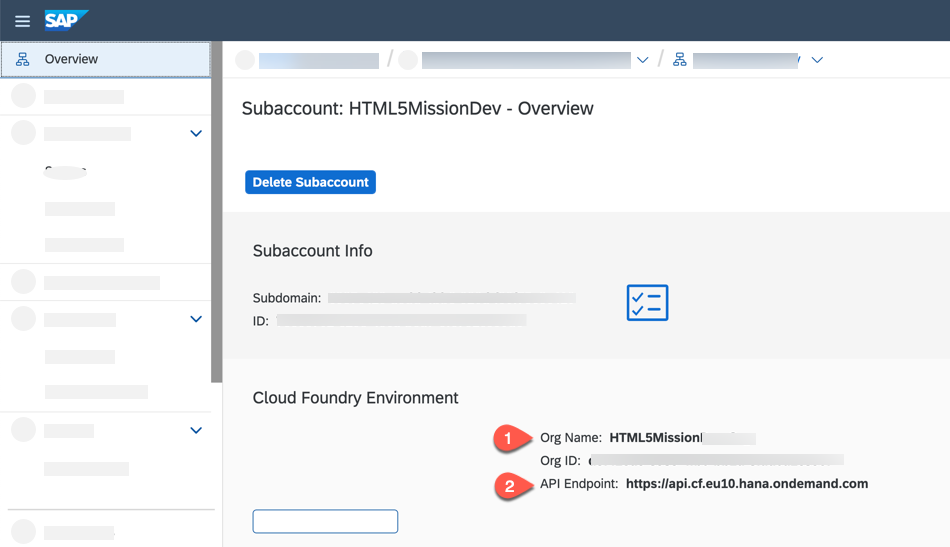
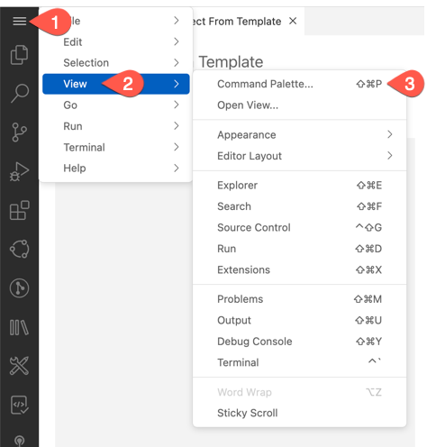
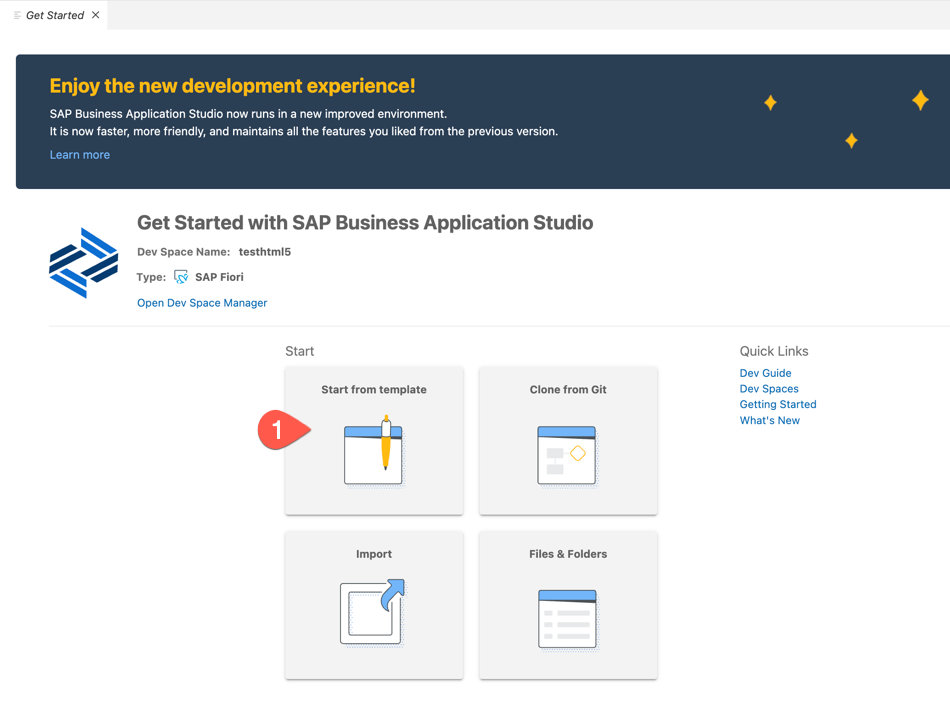
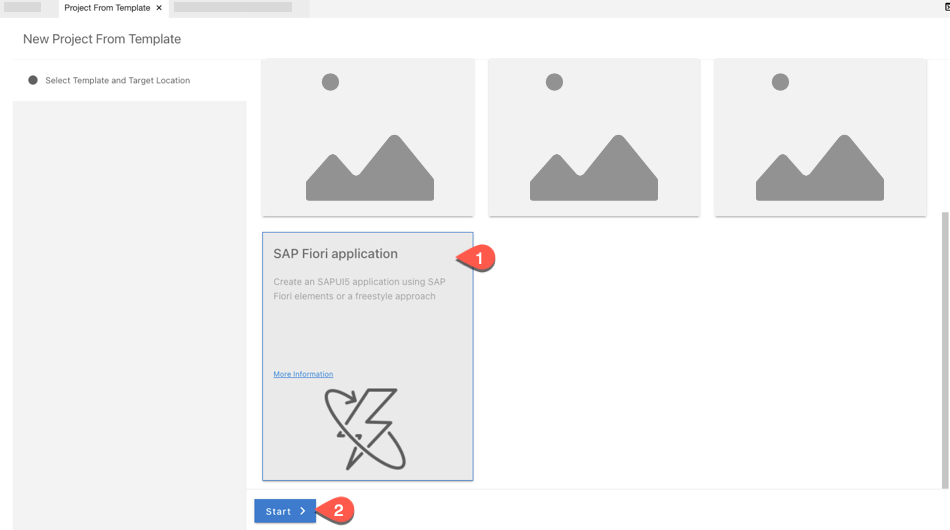
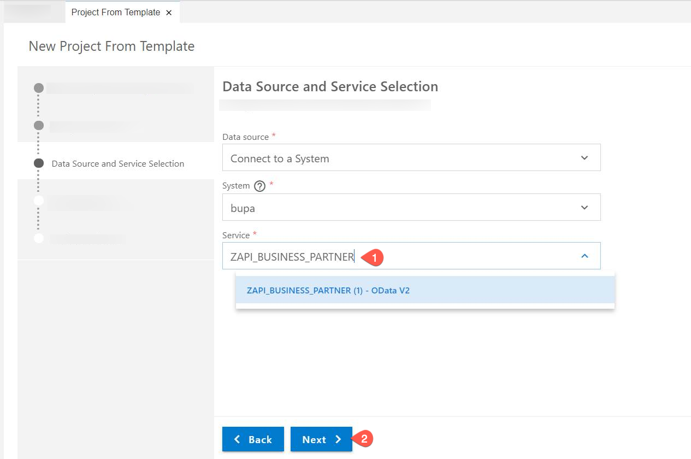
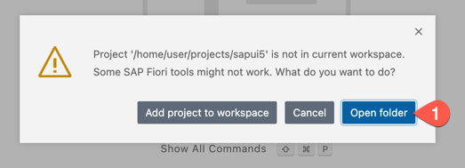

# Develop a HTML5 Cloud Application

## Introduction

SAP Business Application Studio comes out of the box with predefined set of development environments – Dev-Spaces (virtual machine on the cloud where you can develop, build, test and run using pre-installed runtimes and tools) tailored for developing SAP business scenarios.

Create a simple UI extension application in SAP Business Application Studio using existing project templates in order to consume the Business Partner OData service. This application will run as a stand-alone application without a SAP Lauchpad.

**Persona:** UX Developer

## Step-by-Step


### Open SAP Business Application Studio 

1. Login to your SAP BTP cockpit. 
2. Go to your Subaccount and choose **Services** and choose **Instances and Subscriptions**. 
3. Select the tab **Subscriptions**, look for **SAP Business Application Studio**, click the three dots **...** to open the relevant **Actions**. Choose **Go to Application** to open **SAP Business Application Studio**.

   
   
4. You would be prompted with a login screen of either default Identity Provider or custom Identity Provider depending on what you have configured.
5. Login to the Application using your default/custom Identity Provider credentials.

### Create a Dev workspace

1. Choose **Create Dev Space**.
2. Enter the name of the space and choose **SAP Fiori** and choose **Create Dev Space**.

   
  
3. Once the devspace is created, open the dev space which you created now.


### Login to Cloud Foundry in SAP Business Application Studio 

1. You have opened **SAP Business Application Studio** and created and opened a Dev workspace.
2. In the next step, we will log in to Cloud Foundry in **SAP Business Application Studio**, so let us copy the needed parameters in a text editor of your choice. 
3. Switch to the SAP BTP tab and choose **Overview** of the subaccount. Copy the **API Endpoint** and **Org Name** into a text editor of your choice. 

    

4. Choose **Spaces** and write down the space name as well to a text editor of your choice. 

    

5. Switch to the tab where you have opened **SAP Business Application Studio**. Let us customize the editor layout to show the **Menu Bar**. Choose **Customize Layout** on top right, toggle the visibilty of **Menu bar** by selecting it to On.
   
   
   
6. In the Main Menu, choose **View** > **Command Palette**.

	

6. Search for **CF Login** and select **CF: Login on to Cloud Foundry**.

    
    
7. Enter CF API endpoint which you copied in step 3 or take the default suggested API endpoint.     
8. Enter your SAP BTP account **Email** and **Password** when prompted.

   

9. Select your Cloud Foundry **Org** which you have noted down in step 3. 
10. Select the space name which you have noted down in step 4. Once you have selected the Org and Space, you would login to Cloud Foundry in SAP Business Application Studio.
11. Now we have successfully created a workspace and pointed to our desired SAP BTP **Org** and **Space**.

   

### Develop the Application from Project Template

1. Choose **Start from template** in the **Get Started** page to create the project. Alternatively, Go to main menu **File** > **New project from Template**.

   
    
2. In the **New Project Wizard**, select **SAP Fiori Application**. Clhoose **Start**.

   

3. In the **Floorplan Selection**, choose the following:
   - For the field, **Application Type**, choose **SAPUI5 freestyle** from the drop-down.
   - Select floorplan as **SAP Fiori List-Detail Application**.
   - Choose **Next**.
   
     
   
4. In the **Data Source and Service Selection**, choose:
   - For the field **Data Source**, choose **Connect to a System** from the drop-down.
   - For the field **System**, choose the destination which you created for connecting to your on-premise system, in our case choose **bupa**.

     
   
   - In the drop-down for the field **Service**, search **business** and select **ZAPI\_BUSINESS\_PARTNER (1) - OData V2**.
   - Choose **Next**.
  
     

   >If you get an error or you are been asked for credentials then your principal progation setup seems not to be correct or your principal is wrong - check the [troubleshooting section](../../connectivity/README.md#troubleshooting) in the tutorial for the connection setup.   
   
5. In the **Entity Selection** screen: 
   
    - Select drop-down **Object Collection** to **A\_BusinessPartner**.
    - Select drop-down **Object collection key** to **BusinessPartner**.
    - Select drop-down **Object ID** to **BusinessPartnerFullName**.
    - Select drop-down **Object Number** to **None**.
    - Select drop-down **Object Unit of Measure** to **BusinessPartnerCategory**.
    - Select drop-Down **Line Item Collection** to **to\_BusinessPartnerAddress**.
    - Select drop-down **Line Item Collection Key** to **AddressID**.
    - Select drop-down **Line Item ID** to **FullName**.
    - Select drop-down **Line Item Number** to **None**.
    - Select drop-down **Line Item Unit of Measure** to **Country**.
    - Choose **Next**

      
      
6. In the **Project Attributes** screen:
   - For field **Module Name**, enter a meaningful name, for example **sapui5**.
   - For field **Application Title**, enter **S4HANA UI Extension**.
   - For field **Application Namespace**, choose **sap.btp**.
   - Leave the defaults for the **Project folder path**, your project will be created in a folder with the module name you have specified.
   - Select **Yes** for **Add Deployment Configuration**.
   - Optionally, select **Yes** if you want to add **SAP Build Workzone (previously called as Fiori Launchpad**) Configuration, you can then add your application to a company site.
   - Choose **Next**.
 
     
   
7. In the **Deployment Configuration** screen:
   - Choose **Cloud Foundry** as Target.
   - **Destination Name** is prefilled as **bupa**.
   - Choose **Yes** for **Add application to managed application router?**.
   - Choose **Finish** to finish the project creation or choose **Next** if you have opted to add **SAP Build Workzone (previously called as Fiori Launchpad**) configuration in step 6.

     
     
8. In the **Fiori Launchpad Configuration** screen we would configurethe **SAP Build Workzone** configurations:
   - Enter **BusinessPartners** for **Semantic object**.
   - Enter **display** for **Action**.
   - Enter **Business Partners** for **Title**.
   - Enter **List of Business Partners** for **Sub-Title**.
   - Choose **Finish** to finish the project creation.

     
     
9. Once the project is generated, a popup comes up asking you to open the newly generated project folder, choose **Open folder** to open the created project **sapui5**. 

   


10. Check in the generated code if the mapping to the Business Partner Address is correct. 
    - Open **Details.view.xml** from the webapp/view folder of the project.
    - Search for id="lineItemsList" and set the items parameter to **to_BusinessPartnerAddress**
    - Save the file.
    
    ```xml
      ...
      <Table
         id="lineItemsList"
         width="auto"
         items="{to_BusinessPartnerAddress}"
      ...
    ```

    
### Optional Step: Adding Internationalization to Your Project

1. If you want your generated project to have meaningful titles and column names, you can change the default i18n file to any language file you want.
2. In the opened workspace with your project, navigate to project folder **webapp**, then to folder **i18n** and open the file i18n.properties.
3. As a sample content, we have provided you a sample i18n.properties in [Sample i18n](./images/i18n.properties).
4. Replace the contents of the i18n file with our sample content.
5. You will see the customized column headers once we test the application in the next step. 

### Result

You have now configured a development workspace and created a HTML5 Application successfully. Next step we will test and then build and deploy the application.
