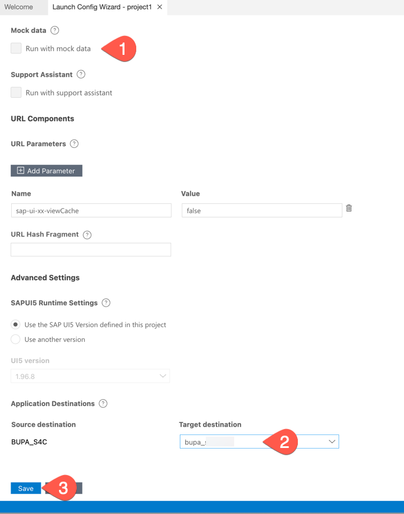
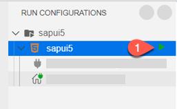

# Testing your Cloud Application

## Introduction

In this section, we would describe steps to test the cloud application which was already created using SAP Business Application Studio.

**Persona:** UX Developer

**Abbreviation:** SAP Business Technology Platform = SAP BTP

## Step-by-Step

### Open Business Application Studio and login to Cloud Foundry

1. Let us open the service **Business Application Studio** by following the steps described in [Open Business Application Studio](../develop/README.md).
2. Login to your SAP BTP account cockpit. 
2. Goto your subaccount and click on **Subscriptions**. 
3. Search for **SAP Business Application Studio** and click on **Go to Application**. 

   
   
4. You would be prompted with a login screen of the custom Identity Provider what you have configured.
5. Login to the Application using your custom Identity Provider credentials.
6. If your workspace is stopped, **Start** it and then Open your previously created **dev** workspace.

   
   
7. Check if you are logged in to your SAP BTP Account from **SAP Business Application Studio**.
8. To login to Cloud Foundry, In the tabs, click on View-> Select **Find Command**.
9. Search for **CF Login**.
10. Select for **CF: Login on to Cloud Foundry**.

     
    
11. Enter CF API endpoint or take the default suggested API endpoint. You can find the API endpoint of your region by switching into your SAP BTP subaccount browser window and copy the API Endpoint. Also write down the **Org Name** into a text editor of your choice which is needed for the next step.  

    
    
12. Choose **Spaces** and write down the space name to a text editor of your choice. 

    
     
13. Enter **Email** and **Password** when prompted.
14. Select your Cloud Foundry **Org** which you have noted down in step 11. 
15. Select the space name which you have noted down in step 12. Once you have selected the Org and Space, you would login to Cloud Foundry in SAP Business Application Studio.

### Test the HTML5 application
   
1. Now let us run and preview the HTML5 application. Click on **Run configuration** icon from left pane and click on **+** to add a new Run configuration.

   
   
2. Choose the application that was created.

   

3. Choose Runnable File: index.html.

   
   
4. Choose UI5 version : latest

    
    
5. Enter a name or leave the default to finish creating a Run configuration.

    
6. Expand the created Run Configuration. Now we need to map a destination for Data source and a XSUAA instance to see the preview application with data.
7. Click on Datasource (Destination) - Click on the green icon next to it.

    
    
8. Choose the Destination which was created in the SAP BTP.

     
     
9. Go to View > Find Command.
10. Search for **Service Instance** and choose **CF: Create new Service Instance**

    
    
11. Enter name : bpuaa

    
    
12. Choose service : xsuaa

    
    
13. Choose plan: application

    
14. Enter a custom xsappname or use the default. Now the XSUAA service instance is created.

    
15. Click on green icon near uaa in the Run configuration and select the created XSUAA instance **bpuaa** in Step 16.

    
    
16. Click on the play icon to run and preview the test application.

    
   
17. Click on **Expose and Open** in the popup that appears.

    
   
18. Give optional name and press **Enter**.

    
   
19. In a new browser window, the Preview Mode of the application is opened. The preview application shows the Business Partners which are fetched from the backend system configured in the SCP Destination.

### Result
Now you have how to test the simple UI application in *SAP Business Application Studio* and also preview the data from your SAP backend system.

   