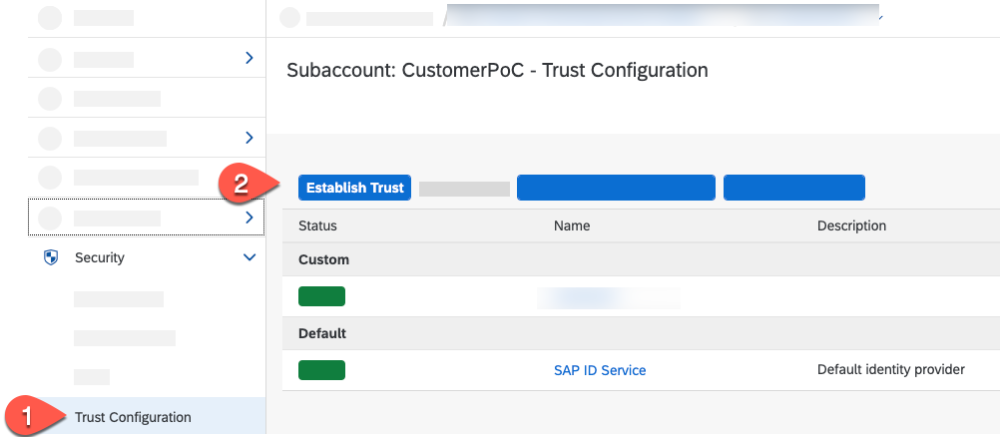
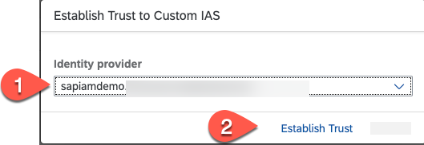
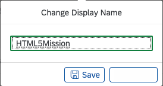
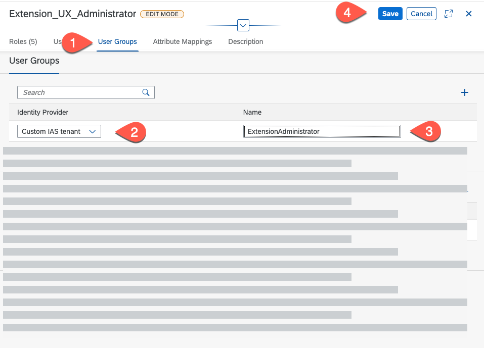
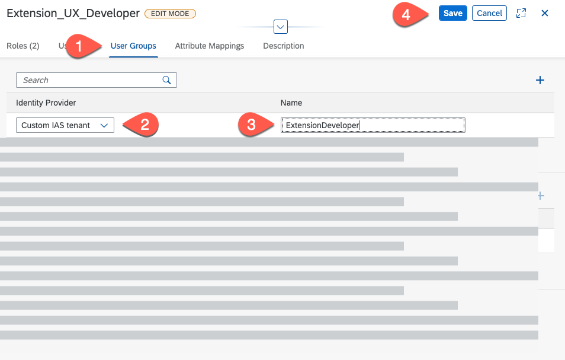

# Configuring Custom Identity Provider

## Introduction

In this section, we would configure a custom Identity Provider which has the users/employees to login to the SAP Business Technology Platform subaccount.
Depending on your global account, you might see the default identity provider, which is configured automatically. This cannot be deleted, it can only be enabled or disabled. 

**Persona:** Cloud Administrator

**Abbreviation:** SAP Business Technology Platform = SAP BTP

## Step-by-Step

Use your SAP Identity Authentication service tenant as an identity provider or a proxy to your own identity provider hosting your business users. This method avoids the upload and download of SAML meta data by using Open ID Connect (OIDC) to establish trust.

### Register SAP BTP subaccount in the Custom Identity Provider

You can manage trust configurations for a global account only if you have created the global account or if you are an SCP Administrator of the account and you are an Administrator in your company's Identity and Authentication Tenant(SAP IAS).

Establishing the trust between your company's IDP could be done in an automatic way.
1. In the  SAP BTP cockpit of your subaccount select Security - Trust Configuration 
2. Click on **Establish Trust**

4. In the popup select your Identity provider.

   ***!Hint:** If your Identity provider is not visible then the SAP BTP account and the IDP have been created with different Customer IDs - in that case please follow the steps for the manual setup with SAML 2.0: [Link to Manual Setup Guide](./README.md).*

5. Click on Establish Trust

   

    At the Trust Configuration screen you should see your custome IDP tenant.

   

6. Now, open your company's Identity and Authentication Tenant (SAP IAS) and login to the same.
7. Select Application in the Application & Resources section.
8. You find a generated application starting with XSUAA_. Select this application
9. Click on the header of the application configuration to change the name 
     

10. Change the display name to a meaningful entry and press Save.
    
     

11. Select the OpenID Connect Configuration section.

    
12. Change the name and press save.

    

13. Check if the Subject Name Identifier is set to E-mail. If not change it.
     

14. Select Attributes. In the Self-defined Attributes section, select **Add** and add a new entry **Groups** with the source **Identity Directory** and value **Groups**. Save your settings. 
    
    

15. In the Home view select User Groups

   

16. Create a Extension Developer group. 
    * Select **Create**
    * Set Name = ExtensionDeveloper
    * Set Display name = ExtensionDeveloper
    * Enter a description
    * Press **Create**

   

17. Create a Extension Administrator group. Same steps as before.     
     * Select **Create**
     * Set Name = ExtensionAdministrator
     * Set Display name = ExtensionAdministrator
     * Enter a description
     * Press **Create**
  
18. Map the group to a user which should have the UX extension developer role. 
    * Open User Management
    * Select your user  
    * Click on User Groups
    * Click on **Assign Groups**
   
   

19. Check the ExtensionDeveloper group and click on save.
   
   

    Repeat the last 2 steps for all user that needs the extension developer privilege.

20. Repeat steps 18 & 19 by mapping the **ExtensionAdministrator** group to all users that should have the UX extension administrator role. 

### Map IDP Groups with Role Collection

1. Go back to your SAP BTP subaccount
2. Select the Trust Configuration in the Security section.
3. Now let us disable the default SAP Identity Provider. Click on Edit button of SAP ID Service.
4.  Change Status to Inactive.

    
5.  Click on Save button.

6. In the Security Menu select 'Role Collections' and then choose the Extension\_UX\_Administrator collection.
   
   
   
   - If your sub account was created manually and not using boosters in case of a  SAP BTP Trial account or "free tier" option with Pay-as-you-go (PAYG) or Cloud Platform Enterprise Agreement (CPEA) account, then you will not have the role collections and have to manually create the role collections. 
      
      a. Select **Role Collections** and choose **+** and create a Role Collection with name **Extension\_UX\_Administrator** 

        
      
      b. Choose **Edit** and assign the following roles to this role collection and choose **Save**.

        
     
      c. Create a new role collection with name **Extension_UX_Developer** and assign the following roles to this role collection and choose **Save**. 

        

7. Select Edit

   

8. Select User Groups then enter the ExtensionAdministrator as name and select your **Custom IAS tenant** as Identity Provider. Press Save.

   

9. Repeat steps 7-8 by selecting the Extension_UX_Developer collection and map it to the ExtensionDeveloper user group.

      

10. To test the configuration open the service **SAP Business Application Studio** by clicking **Services** and then choose **Instances and Subscriptions**. Select the tab **Subscriptions** and click **...**, choose **Go to Application**. Now login to **SAP Business Application Studio** by choosing the Custom Identity Provider and login with your custom IDP user.(If you have already a open session restart your browser).

### References
Check the [official SAP Help documentation](https://help.sap.com/viewer/65de2977205c403bbc107264b8eccf4b/Cloud/en-US/161f8f0cfac64c4fa2d973bc5f08a894.html).
    

