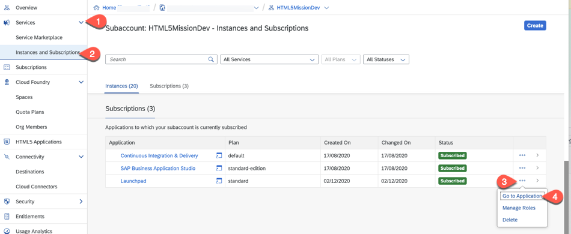
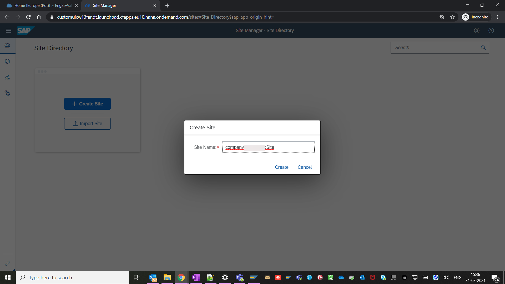
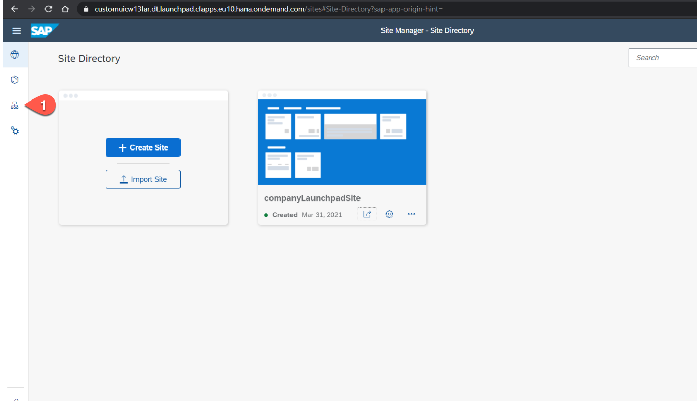
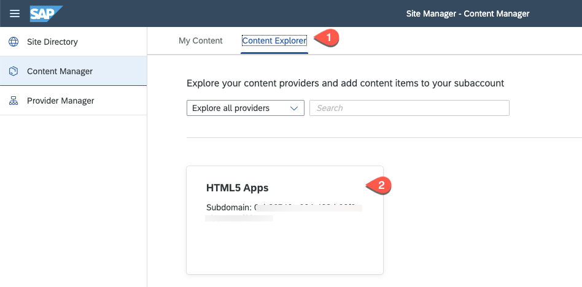
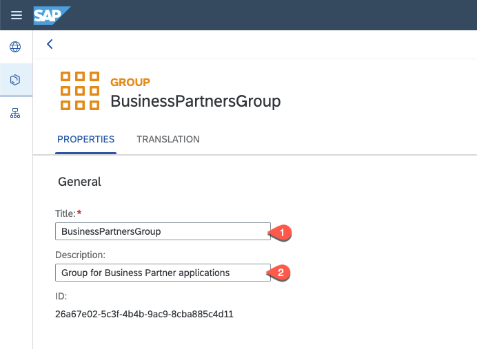
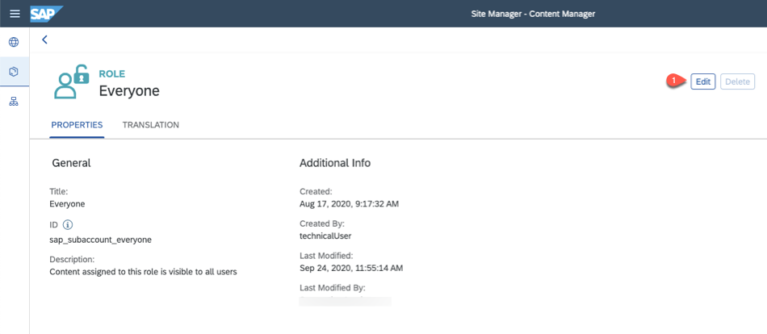
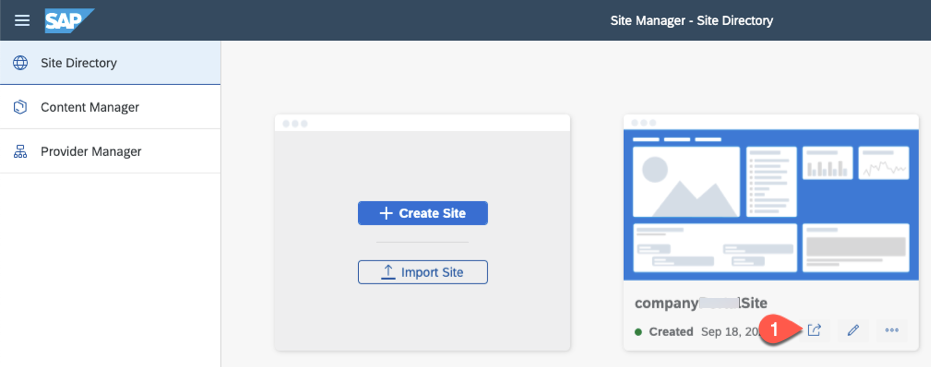
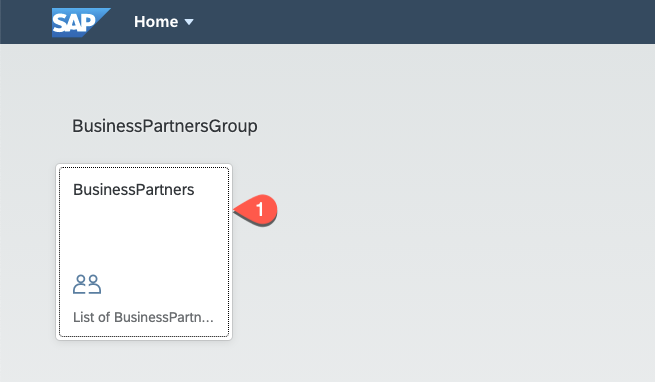
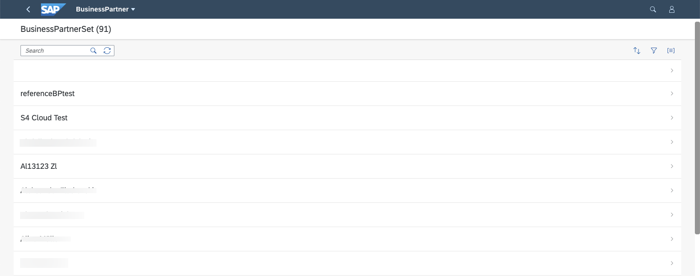

# Publishing your application to SAP Launchpad Site

## Introduction

In this section, we would describe steps of how you can add your HTML5 application to the Launchpad and how you can build a company site with the HTML5 application.

**Persona:** Launchpad Administrator

**Abbreviation:** SAP Business Technology Platform = SAP BTP

## Step-by-Step

### Open Business Application Studio and login to Cloud Foundry

1. Let us open the service **Business Application Studio** by following the steps described in [Open SAP Business Application Studio](../create-application/develop/README.md#open-sap-business-application-studio).
2. If your workspace is stopped, click **Start** to start your dev space and click the name of your dev space to open your workspace.

   

3. Login to Cloud Foundry following the steps described in [Login to CF](../create-application/develop/README.md#login-to-cloud-foundry-in-sap-business-application-studio).


### Expose HTML5 Applications in Launchpad

In order that your HTML5 applications are visible to the Launchpad application, you have currently to add some information to the manifest.json file. This information is added automatically by the [Create Project from Template wizard](https://github.com/SAP-samples/cloud-extension-html5-sample/tree/mission/mission/create-application/develop#develop-the-application-from-project-template) if you have chosen **Yes** to add Fiori Launchpad Configuration. You can also add the code snippet in step 3 manually. The HTML5 applications you want to expose must be deployed to the same subaccount as the Launchpad. 

For more information, check [Expose HTML5 Applications in Launchpad](https://help.sap.com/viewer/ad4b9f0b14b0458cad9bd27bf435637d/Cloud/en-US/3a0e6d6b791c4c2189f6a0a424188362.html).


1. Switch to the browser window with **SAP Business Application Studio** and open the Workspace containing your HTML5 project.
2. Expand your HTML5 project and open the manifest.json file which is under the folder BP -> webapp -> manifest.json 
3. Open the manifest.json and check if the following source code snippet inside the **sap.app** section is already added automatically from the Project creation wizard. If you don't have this code snippet, add the following snippet manually. Do not forget to add a **,** to this **sap.app** section before you add the code below.

   ```
   "crossNavigation": {
            "inbounds": {
                "intent1": {
                    "signature": {
                        "parameters": {},
                        "additionalParameters": "allowed"
                    },
                    "semanticObject": "BusinessPartners",
                    "action": "display",
                    "title": "BusinessPartners",
                    "info": "List of BusinessPartners",
                    "icon": "sap-icon://BusinessSuiteInAppSymbols/icon-business-partner"
                }
            }
        }
   ```
4. In order that data of the extension application is displayed correctly in the SAP Launchpad site, check also the value of **sap.cloud** in webapp/manifest.json file.

   

5.  You have to now build and deploy the application with these changes, refer to [Build, Deploy and Run HTML5 Application on SAP BTP](../create-application/buildDeploy/README.md).

### Create a Launchpad Site

1. Login to your SAP BTP account.
2. Check if your user has access to open Launchpad application, check and assign the role collection **Launchpad_admin** to your user following [Assign Role for SAP Launchpad](https://help.sap.com/viewer/8c8e1958338140699bd4811b37b82ece/Cloud/en-US/fd79b232967545569d1ae4d8f691016b.html). Your user would have automatically got the necessary roles if you have [created a BTP account using the boosters](../scp-setup/README.md).
2. Click **Services** and choose **Instances and Subscriptions**. 
3. Select the tab **Subscriptions**, look for **Launchpad**, click the three dots **...** to open the relevant **Actions**. Click **Go to Application** to open **SAP Launchpad** service. 

   
   
4. Enter your SAP BTP email and password or your custom Identity Provider credentials to login to the Launchpad Application which opens in a separate browser tab.

5. Click on *Create Site* to create a company Launchpad site.
   
   

6. Enter a site name, for example : *companyLaunchpadSite* and click *Ok*.

   
   
7. Now we have created a Launchpad site. In the next step,let us create necessary Groups and Roles needed.

### Add HTML5 application to necessary Group and Role
  
1. Click on *Provider Manager* to check the Content Providers and to refresh the list of HTML5 Applications. 

   
   
2.  Click on *Fetch Updated Content* to manually fetch any new HTML5 applications deployed to the SAP BTP. This will fetch any new content deployed. Then click on *Content Manager* to look and add the HTML5 apps to Launchpad site.

   
   
3. In *Content Manager*, click on *Content Explorer* tab and click on *HTML5 Apps* to see the list of HTML5 applications to be added to the Launchpad site.

    
    
4. Select your HTML5 application which you see in the list and click on *Add to Content*. 

   
   
5. Click on *My Content* tab and click on *New* and click on *Group* to create a new group.

   
   
6. Enter a group name, for example: **BusinessPartnersgroup** and a valid description.

   
   
7. Now in the *Assignments* section, search for *S4 HANA* and add the listed HTML5 app by clicking **+** to the new group. Click **Save** to save the changes.

    

8. Check the assigned App to the newly created group and click **<** to go the previous screen.

   
   
9. Click on *Everyone* role to assign our HTML5 Application for testing purposes. You can create your company specific roles and assign the HTML5 applications accordingly.

   
   
10. Click **Edit** to edit the *Everyone* role.

    
   
11. In the *Assignments* section, search for *BusinessPartner* and add the listed HTML5 app by clicking **+**. Click **Save** to save the changes.

    
   
12. Check the assigned App to the *Everyone* role and click the Globe icon to go the *Site Directory*.

    
   


### Adding HTML5 application to the Launchpad site

1. In the Site Manager, you can see the company Launchpad site, click **Go to site** to open the site.

   
   
2. Enter the email and password for opening the Launchpad site.
   
3. You can see the *BusinessPartners* application available as a tile in the company Launchpad site. Click on the tile to open the application.

   
   
4. You can see that the **BusinessPartners** application opens in the Launchpad site successfully as below. 

   

### Result

You have successfully created a Launchpad site, giving necessary roles and groups and added your HTML5 application to the Launchpad site.
